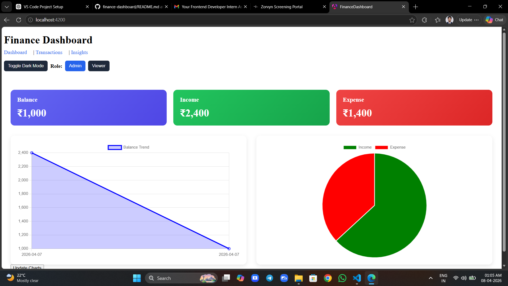
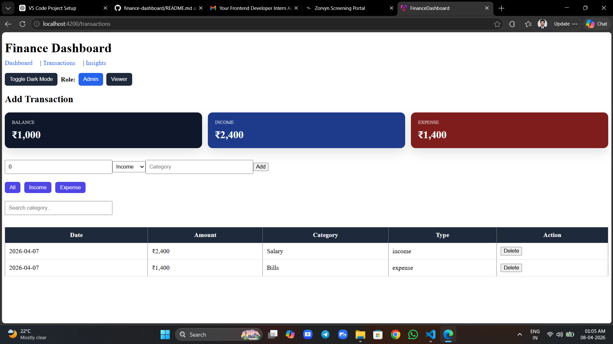

# 💰 Finance Dashboard (Angular)

A simple and interactive finance dashboard to track income and expenses with charts and insights.

---

## 🚀 Live Demo
👉 (https://stupendous-churros-7369a1.netlify.app)

---

## 📸 Screenshots

### Dashboard


### Transactions


---

## ✨ Features

- ➕ Add & Delete Transactions  
- 🔍 Search Transactions  
- 🎯 Filter (Income / Expense)  
- 📊 Line Chart (Balance Trend)  
- 🥧 Pie Chart (Income vs Expense)  
- 💾 Local Storage Persistence  
- 🌙 Dark Mode Toggle  

---

## 🛠 Tech Stack

- Angular  
- TypeScript  
- Chart.js  
- HTML / CSS  

---

## ⚙️ How to Run Locally

```bash
git clone https://github.com/Er-Sarfaraz-Ahmad/finance-dashboard.git
cd finance-dashboard
npm install
ng serve
